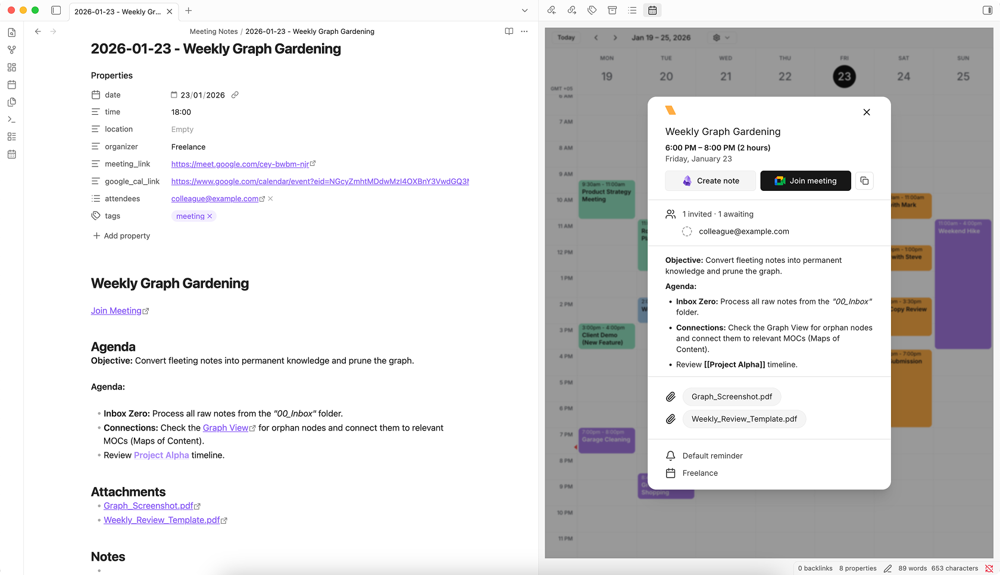

# Viewday Official

This is the official plugin maintained by the Viewday team, designed to turn Obsidian into the ultimate visual planner.

Viewday is a **Universal Calendar Layer** that seamlessly blends your real-time **Google Calendar** meetings with your **local Obsidian notes and tasks**. No manual API key setup required.

> Note: This plugin requires an account with [Viewday](https://viewday.app). A free tier is available (which includes Drag-and-Drop local time blocking), while advanced features like multi-account Google merging require a subscription.

## 🌟 Highlights

**The Unscheduled Backlog ("The Hopper")** Have notes or tasks with no date? Open the Unscheduled Sidebar to view all your floating ideas. Drag an unscheduled note directly onto the calendar grid, and Viewday will instantly write the date and time to that file's YAML frontmatter.

**Drag-and-Drop Time Blocking** Manage your vault visually. Drag existing local tasks to new days or times, and Viewday will automatically update the underlying markdown file. It natively respects your `duration` frontmatter to block out the exact right amount of time.

**The Creation Engine** Don't just view your schedule—build it. Click any empty slot on the grid to instantly generate a new Markdown file. Viewday will drop it in your vault and automatically inject the correct date/time into your frontmatter properties. 

**Secure Google "Write-Back"** Need to schedule a Google Meeting? Click the grid to securely launch a pre-filled Google Calendar event. Viewday handles the scheduling without ever asking for invasive "Delete/Edit" permissions to your entire Google account.

**Smart Meeting Notes** Jumpstart your note-taking with one click. Viewday automatically captures attendees, agenda, location, and links into a Dataview-ready format so you can focus on capturing minutes and ideas.

## ✨ Features at a Glance

- **Universal Sources:** Mix and match local project deadlines (Obsidian) with shared team events (Google Calendar) in a single, unified view.
- **Real-time Sync:** Your Google calendar updates instantly in Obsidian. Local file changes are reflected on the grid with zero latency.
- **De-Google Friendly:** You can use Viewday with zero Google accounts connected, relying 100% on your local vault via our Local Rules Engine.
- **Join Meetings:** Launch Google Meet, Zoom, or Teams calls directly from your sidebar with one click.
- **Theme Awareness:** Automatic dark/light theme switching that matches your vault perfectly.

## 🚀 Getting Started

1. **Sign Up:** Create a free account at [viewday.app](https://viewday.app).
2. **Configure Sources:** Connect your Google Calendar(s) and define your "Local Rules" (e.g., scan for the `do_date` property).
3. **Generate a Widget:** Create a new View in the dashboard to get your unique **Widget ID**.
4. **Install & Paste:** Install this plugin, then paste your **Widget ID** into the Viewday Plugin settings in Obsidian.
5. **Open:** Click the calendar icon in your ribbon (left sidebar) to open your command center.

## 🛠️ Technical Details

This plugin acts as a highly optimized, secure wrapper for the Viewday web engine.
- **Privacy:** The plugin only stores your `Widget ID` and folder preferences locally.
- **Security:** All Google Calendar data is handled via Viewday's encrypted backend. We use a Secure Deep Link architecture for creating events, meaning we never request full write access to your Google Calendar.
- **Local First:** Local markdown file parsing happens entirely on your machine.
- **Performance:** Optimized with targeted file caching and debounced updates to ensure zero impact on your vault's speed.

## 📈 Pricing

Viewday is a **Freemium** service. 
- **Free:** Use 1 Google Calendar account + 1 Local Obsidian Source. Includes drag-and-drop local time blocking.
- **Pro ($3.50/mo):** Unlock unlimited Google accounts, unlimited local rules, agenda views, and remove Viewday branding.

## 🤝 Support & Feedback

- **Dashboard:** [viewday.app/dashboard](https://viewday.app/dashboard)
- **Feature Requests:** [viewday.app/feature-requests](https://viewday.app/feature-requests)
- **Contact:** [viewday.app/contact](https://viewday.app/contact) or email us at [hello@viewday.app](mailto:hello@viewday.app)

---
*Built with ❤️ for the Obsidian community.*