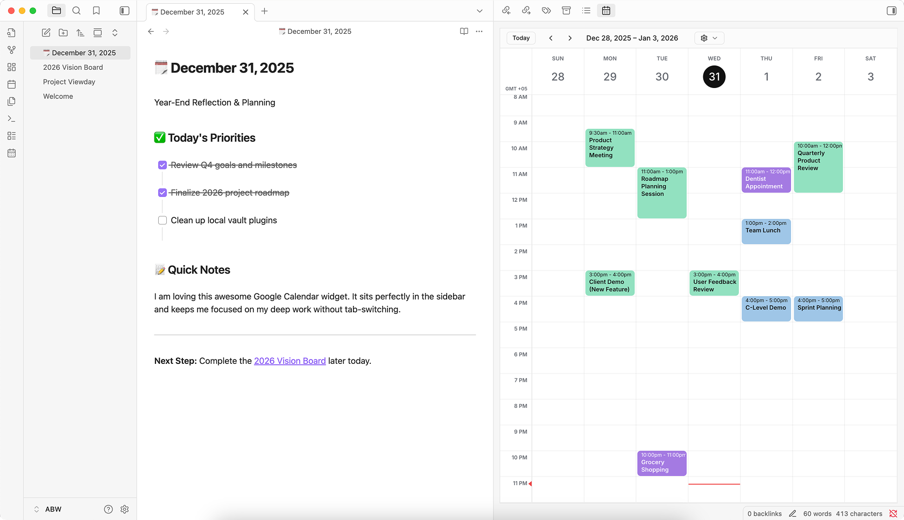
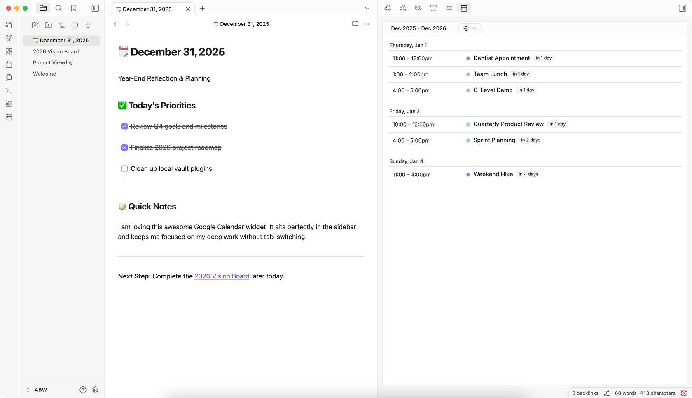
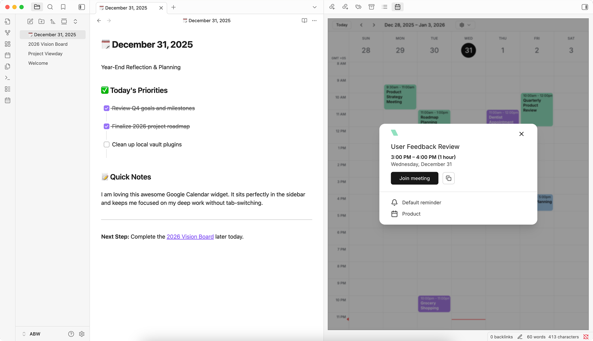

# Viewday Official

This is the official plugin maintained by the Viewday team designed to bring your Google Calendar into Obsidian.

A real-time Google Calendar for Obsidian with **multi-account and multi-calendar sync**, **secure OAuth authentication**, and **automatic dark mode support**. No manual API key setup required.

> Note: This plugin requires an account with [Viewday](https://viewday.app) - A service that securely brings Google Calendar to your productivity tools. A free tier is available, while advanced features like multi-account merging and agenda views require a subscription.

**Agenda View**: Stay focused with a high-density Agenda view for your daily tasks.

**Join Meetings Directly**: Join Google Meet calls directly from your sidebar with one click.

**Theme Awareness**: Automatic dark/light theme switching that matches your vault.

## ✨ Features

Viewday provides a **native-feeling, high-performance** Google Calendar bridge for Obsidian vaults:

- **Real-time Sync:** Your calendar updates instantly in Obsidian when you add or change events in Google Calendar.
- **Multi-Account Support:** Merge multiple Google Calendars (Work, Personal, Family) into a single, clean view.
- **Aesthetic-First:** Designed with a clean, modern aesthetic that complements any Obsidian theme.
- **No Manual API Keys:** Connect via secure Google OAuth; no need to mess with Google Cloud Console.
- **Seamless Theme Sync:** Instantly detects and matches your Obsidian Light/Dark mode without page refreshes.
- **Agenda & Grid Views:** Toggle between month, week, day, or a focused agenda view.

## 🚀 Getting Started

1. **Install the Plugin:** Search for "Google Calendar by Viewday (Official)" in the Obsidian Community Plugins store and click Install.
2. **Connect your Calendar:** Sign up at [viewday.app/signup](https://viewday.app/signup) and link your Google accounts.
3. **Get your Widget ID:** Create a calendar widget in your dashboard and copy the **Widget ID**.
4. **Configure:** Paste your **Widget ID** into the Viewday Plugin settings in Obsidian.
5. **Open:** Click the calendar icon in your ribbon (left sidebar) to open your Google Calendar live view.

## 🛠️ Technical Details

This plugin acts as a secure wrapper for the Viewday web application using a sandboxed `iframe`.
- **Privacy:** The plugin only stores your `Widget ID` locally in your vault's settings.
- **Security:** All Google Calendar data is handled via Viewday's encrypted backend and never touches your local markdown files. [Learn more about Viewday's security](https://viewday.app/security)
- **Performance:** Optimized with database indexing and scoped realtime streams to ensure zero impact on your vault's speed.

## 📈 Pricing

Viewday is a **Freemium** service. 
- **Free:** Use one Google Calendar with standard views and "Powered by Viewday" branding.
- **Pro:** Unlock multi-account & multi-calendar merging, agenda view, and remove branding for a small monthly or lifetime fee.

## 🤝 Support & Feedback

- **Dashboard:** [viewday.app/dashboard](https://viewday.app/dashboard)
- **Feature Requests:** [viewday.app/feature-requests](https://viewday.app/feature-requests)
- **Contact:** [viewday.app/contact](https://viewday.app/contact) or email us at [hello@viewday.app](mailto:hello@viewday.app)

---
*Built with ❤️ for the Obsidian community.*